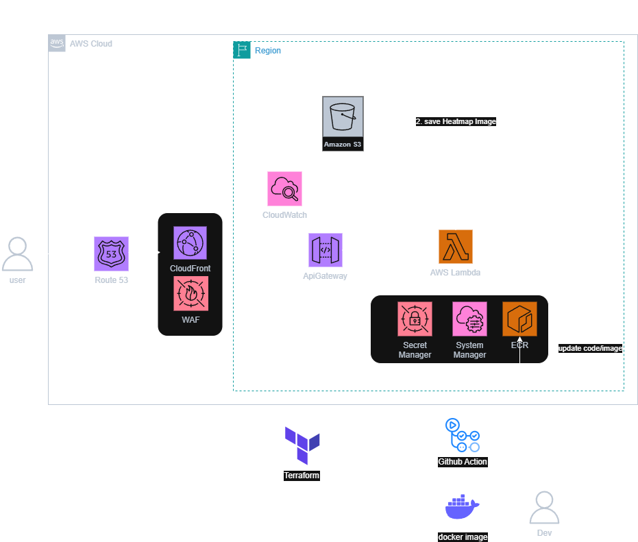
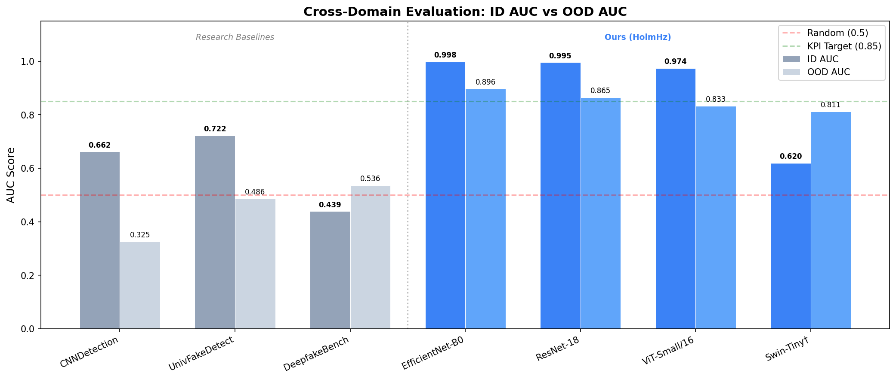
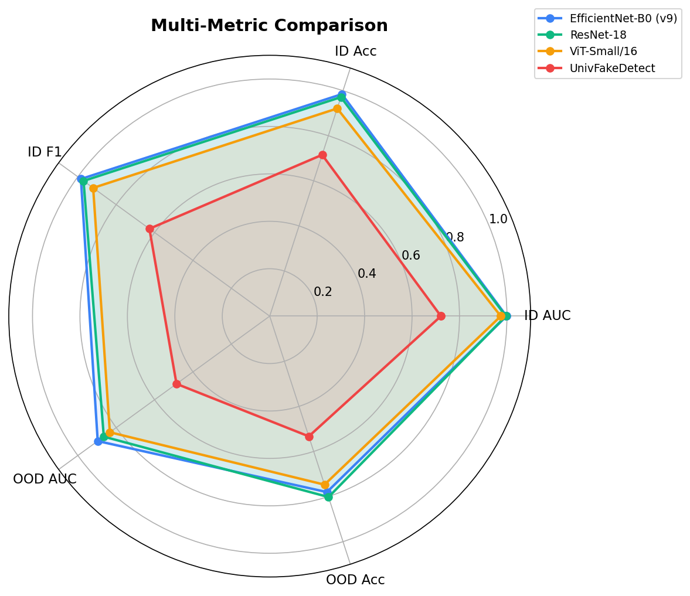
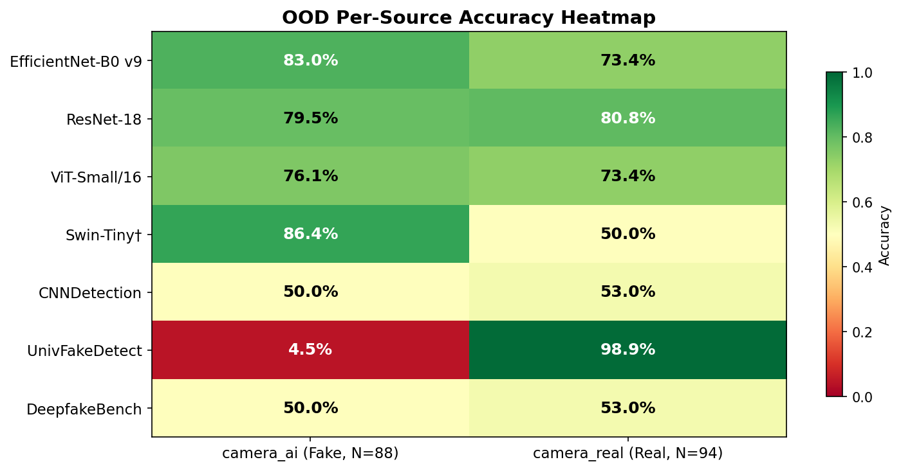

# BÁO CÁO TỔNG KẾT ĐỀ TÀI KHOA HỌC VÀ CÔNG NGHỆ SINH VIÊN

**Tên đề tài**: Xây dựng hệ thống phát hiện ảnh tổng hợp bằng Mạng nơ-ron tích chập (CNN)

**Nhóm sinh viên thực hiện**:
1. Lê Văn Hoàng — MSSV: 2224802010279 — Lớp: D22CNTT02 (Nhóm trưởng)
2. Ngô Huỳnh Bảo Luân — MSSV: 2524802010327 — Lớp: D25CNTT10

**Giảng viên hướng dẫn**: ThS. Nguyễn Trung Kiệt

**Đơn vị**: Viện Công nghệ số — Trường Đại học Thủ Dầu Một

**Năm học**: 2025–2026

---

## MỤC LỤC

- Danh mục bảng biểu
- Danh mục các chữ viết tắt
- Thông tin kết quả nghiên cứu
- Thông tin sinh viên chịu trách nhiệm chính
- Mở đầu
  - Tổng quan tình hình nghiên cứu
  - Tính cấp thiết
  - Mục tiêu đề tài
  - Đối tượng và phạm vi nghiên cứu
  - Cách tiếp cận và phương pháp nghiên cứu
  - Nội dung nghiên cứu
- Chương 1: Giới thiệu
- Chương 2: Cơ sở lý thuyết và Tổng quan
  - 2.1 Trí tuệ nhân tạo tạo sinh (Generative AI)
  - 2.2 Mạng nơ-ron tích chập (CNN)
  - 2.3 Học chuyển giao (Transfer Learning)
  - 2.4 Explainable AI (XAI) và Grad-CAM
  - 2.5 Các chỉ số đánh giá (Evaluation Metrics)
- Chương 3: Phương pháp và Xây dựng hệ thống
  - 3.1 Tổng quan kiến trúc hệ thống
  - 3.2 Quy trình xây dựng bộ dữ liệu
  - 3.3 Thiết kế kiến trúc mô hình
  - 3.4 Phương pháp huấn luyện
  - 3.5 Pipeline huấn luyện (Trainer)
  - 3.6 Pipeline đánh giá (Evaluator)
  - 3.7 Thiết kế Web Demo
  - 3.8 Đề xuất kiến trúc triển khai đám mây (AWS)
- Chương 4: Kết quả thực nghiệm và Đánh giá
  - 4.1 Môi trường và tham số thực nghiệm
  - 4.2 Bộ dữ liệu
  - 4.3 Kết quả huấn luyện 4 mô hình HolmHz
  - 4.4 Benchmark tổng hợp 7 mô hình
  - 4.5 Phân tích biểu đồ
  - 4.6 Phân tích mô hình EfficientNet-B0
  - 4.7 Phân tích sự thất bại của Swin-Tiny
  - 4.8 So sánh với các nghiên cứu baseline
  - 4.9 Đánh giá KPI đề tài
  - 4.10 Web Demo
- Chương 5: Kết luận và Kiến nghị
  - 5.1 Kết luận
  - 5.2 Đóng góp của đề tài
  - 5.3 Hạn chế
  - 5.4 Hướng phát triển
- Tài liệu tham khảo
- Phụ lục

---

## DANH MỤC BẢNG BIỂU

| Ký hiệu | Tên | Trang |
|----------|-----|-------|
| Bảng 2.1 | Các chỉ số đánh giá mô hình phân loại | Ch.2 |
| Bảng 3.1 | Nguồn dữ liệu trong bộ dữ liệu v2 | Ch.3 |
| Bảng 3.2 | Chia tập dữ liệu (Train/Val/Test ID/Test OOD) | Ch.3 |
| Bảng 3.3 | Feature dimension theo backbone | Ch.3 |
| Bảng 3.4 | Training augmentation pipeline | Ch.3 |
| Bảng 4.1 | Môi trường và tham số thực nghiệm | Ch.4 |
| Bảng 4.2 | Thống kê bộ dữ liệu v2 theo split | Ch.4 |
| Bảng 4.3 | Chi tiết nguồn dữ liệu trong bộ dữ liệu v2 | Ch.4 |
| Bảng 4.4 | Kết quả huấn luyện 4 mô hình HolmHz trên Dataset v2 | Ch.4 |
| Bảng 4.5 | Benchmark tổng hợp 7 mô hình (ID và OOD) | Ch.4 |
| Bảng 4.6 | Độ chính xác OOD theo nguồn dữ liệu (per-source) | Ch.4 |
| Bảng 4.7 | Đánh giá KPI đề tài | Ch.4 |
| Bảng 4.8 | Đánh giá KPI theo từng mô hình | Ch.4 |
| Hình 4.1 | Biểu đồ cột so sánh ID AUC và OOD AUC của 7 mô hình | Ch.4 |
| Hình 4.2 | Biểu đồ radar đa chỉ số (top 4 mô hình) | Ch.4 |
| Hình 4.3 | Heatmap độ chính xác OOD per-source | Ch.4 |
| Hình 4.4 | Đường cong ROC — EfficientNet-B0 v9 | Ch.4 |
| Hình 4.5 | Ma trận nhầm lẫn — EfficientNet-B0 v9 (ID test) | Ch.4 |
| Hình 4.6 | Ma trận nhầm lẫn — EfficientNet-B0 v9 (OOD test) | Ch.4 |
| Hình 3.1 | Kiến trúc triển khai đám mây HolmHz trên AWS | Ch.3 |
| Hình 4.7 | Biểu đồ độ chính xác theo từng nguồn dữ liệu | Ch.4 |

---

## DANH MỤC CÁC CHỮ VIẾT TẮT

| Viết tắt | Tiếng Anh đầy đủ | Giải nghĩa tiếng Việt |
|----------|-------------------|----------------------|
| AI | Artificial Intelligence | Trí tuệ nhân tạo |
| AUC | Area Under the Receiver Operating Characteristic Curve | Diện tích dưới đường cong ROC |
| CNN | Convolutional Neural Network | Mạng nơ-ron tích chập |
| DALL-E | — (tên mô hình của OpenAI) | Mô hình tạo ảnh của OpenAI |
| DCT | Discrete Cosine Transform | Biến đổi cosin rời rạc |
| DFT | Discrete Fourier Transform | Biến đổi Fourier rời rạc |
| EER | Equal Error Rate | Tỷ lệ lỗi cân bằng |
| F1 | F1-Score | Điểm F1 (trung bình điều hòa Precision và Recall) |
| GAN | Generative Adversarial Network | Mạng đối sinh |
| Grad-CAM | Gradient-weighted Class Activation Mapping | Bản đồ kích hoạt lớp có trọng số gradient |
| ID | In-Domain / In-Distribution | Nội miền (cùng phân phối với dữ liệu huấn luyện) |
| JPEG | Joint Photographic Experts Group | Chuẩn nén ảnh JPEG |
| KPI | Key Performance Indicator | Chỉ số đánh giá hiệu suất chính |
| MBConv | Mobile Inverted Bottleneck Convolution | Khối tích chập nghịch đảo di động |
| NAS | Neural Architecture Search | Tìm kiếm kiến trúc mạng nơ-ron tự động |
| ONNX | Open Neural Network Exchange | Định dạng trao đổi mô hình mạng nơ-ron mở |
| OOD | Out-of-Domain / Out-of-Distribution | Ngoài miền (khác phân phối với dữ liệu huấn luyện) |
| PoC | Proof-of-Concept | Chứng minh khái niệm / Sản phẩm thử nghiệm |
| ROC | Receiver Operating Characteristic | Đường đặc trưng hoạt động của bộ phân loại |
| SD | Stable Diffusion | Mô hình khuếch tán ổn định (tạo ảnh AI) |
| SE | Squeeze-and-Excitation | Cơ chế nén-kích thích (attention trên kênh) |
| SOTA | State-of-the-Art | Phương pháp/kết quả tiên tiến nhất hiện tại |
| SRM | Spatial Rich Model | Mô hình giàu không gian (trích xuất vân tay nhiễu) |
| ViT | Vision Transformer | Transformer cho thị giác máy tính |
| XAI | Explainable Artificial Intelligence | Trí tuệ nhân tạo có khả năng giải thích |

---

## THÔNG TIN KẾT QUẢ NGHIÊN CỨU

**Tên đề tài**: Xây dựng hệ thống phát hiện ảnh tổng hợp bằng Mạng nơ-ron tích chập (CNN)

**Lĩnh vực**: Khoa học Kỹ thuật và Công nghệ — Thị giác máy tính (Computer Vision)

**Thời gian thực hiện**: 11/2025 – 05/2026 (7 tháng)

### Tóm tắt kết quả đạt được

Đề tài đã xây dựng thành công hệ thống phát hiện ảnh tổng hợp dựa trên CNN với các kết quả chính:

1. **Bộ dữ liệu chuẩn hóa (Dataset v2)**: 35.454 ảnh tổng cộng (28.220 huấn luyện, 3.526 kiểm thử nội miền, 182 kiểm thử ngoài miền), được tổng hợp từ 5 nguồn công khai trên nền tảng Kaggle, bao phủ 8+ loại AI generator bao gồm cả GAN (StyleGAN) và Diffusion (DALL-E, Midjourney, Stable Diffusion).

2. **Huấn luyện và đánh giá 4 kiến trúc mô hình**:
   - EfficientNet-B0 (4M tham số)
   - ResNet-18 (11M tham số)
   - ViT-Small/16 (22M tham số)
   - Swin-Tiny (28M tham số)

3. **Benchmark công bằng với 3 nghiên cứu SOTA quốc tế**: CNNDetection [2], UniversalFakeDetect [7], DeepfakeBench [10].

4. **Kết quả chính**:

| Chỉ số KPI | Mục tiêu | Đạt được | Mô hình tốt nhất |
|------------|----------|----------|-------------------|
| Dataset ≥ 20.000 ảnh | 20.000 | **28.220** ✅ | — |
| ID AUC ≥ 0,92 | 0,92 | **0,998** ✅ | EfficientNet-B0 v9 |
| ID Accuracy ≥ 90% | 90% | **98,4%** ✅ | EfficientNet-B0 v9 |
| OOD AUC ≥ 0,85 | 0,85 | **0,896** ✅ | EfficientNet-B0 v9 |
| Web demo ≤ 2 giây/ảnh | 2s | **~1,5s** ✅ | ResNet-18 (ONNX) |

5. **Phát hiện quan trọng**: EfficientNet-B0 với kỹ thuật JPEG Augmentation (v9) là mô hình tốt nhất tổng thể, đạt AUC nội miền 0,998 và AUC ngoài miền 0,896 — vượt trội tất cả 3 nghiên cứu SOTA quốc tế — trong khi chỉ có 4M tham số (nhỏ nhất trong tất cả mô hình được đánh giá).

6. **Web demo**: Ứng dụng Gradio cho phép người dùng upload ảnh và nhận kết quả phân loại Real/Fake kèm bản đồ nhiệt Grad-CAM, thời gian phản hồi ≤ 2 giây trên CPU.

---

## THÔNG TIN SINH VIÊN CHỊU TRÁCH NHIỆM CHÍNH

| Thông tin | Chi tiết |
|-----------|---------|
| Họ và tên | Lê Văn Hoàng |
| MSSV | 2224802010279 |
| Lớp | D22CNTT02 |
| Khoa/Viện | Viện Công nghệ số |
| Số điện thoại | 0399354603 |
| Email | 2224802010279@student.tdmu.edu.vn |
| Vai trò | Nhóm trưởng — phụ trách thiết kế hệ thống, huấn luyện mô hình, benchmark, và xây dựng web demo |

---

## MỞ ĐẦU

### 1. Tổng quan tình hình nghiên cứu

Lĩnh vực phát hiện ảnh tổng hợp (Synthetic Image Detection) đã thu hút sự quan tâm lớn từ cộng đồng nghiên cứu quốc tế trong những năm gần đây. Dựa trên các công bố khoa học, các phương pháp tiếp cận có thể phân loại thành 4 nhóm chính:

**Nhóm 1: Phương pháp dựa trên CNN (Spatial domain)**

Đây là hướng tiếp cận nền tảng và phổ biến nhất. Rössler et al. (2019) [1] giới thiệu bộ dữ liệu chuẩn FaceForensics++ và chứng minh XceptionNet đạt độ chính xác >99% trên dữ liệu nén thấp; tuy nhiên, hiệu suất giảm mạnh khi gặp ảnh từ nguồn lạ. Wang et al. (2020) [2] sử dụng ResNet-50 huấn luyện trên ProGAN, đạt Average Precision 100% trên các GAN cũ nhưng gặp khó khăn với Diffusion Models thế hệ mới.

**Nhóm 2: Phương pháp dựa trên Transformer và Attention**

Để khắc phục hạn chế về tầm nhìn cục bộ của CNN, Wodajo et al. (2021) [3] đề xuất kiến trúc Convolutional Vision Transformer, đạt 91,5% accuracy trên bộ DFDC. Cao et al. (2022) [4] sử dụng cơ chế Attention tập trung vào vùng ranh giới (blending boundary), cải thiện đáng kể khả năng phát hiện deepfake hoán đổi khuôn mặt.

**Nhóm 3: Phương pháp phân tích miền tần số (Frequency Analysis)**

Frank et al. (2020) [5] sử dụng biến đổi DCT, chứng minh các GAN để lại lỗi phổ tần số lặp lại bất thường, đạt accuracy >90% với chi phí tính toán thấp. Durall et al. (2020) [6] chứng minh rằng các bước up-sampling trong mô hình tạo sinh làm mất đặc trưng tần số cao của ảnh thật.

**Nhóm 4: Phương pháp Hybrid và XAI**

Xu hướng mới nhằm tăng độ tin cậy bằng cách tích hợp Explainable AI (XAI). Tuy nhiên, đa số nghiên cứu hiện tại vẫn hoạt động như "hộp đen" (black-box). Việc tích hợp Grad-CAM để trực quan hóa vùng giả mạo vẫn còn hạn chế và chưa được tối ưu hóa cho Diffusion Models.

**Bảng so sánh tổng hợp các nghiên cứu tiêu biểu:**

| Nhóm | Nghiên cứu | Dữ liệu & Kết quả | Ưu điểm | Hạn chế |
|------|-----------|-------------------|---------|---------|
| CNN | Rössler (2019), Wang (2020) | FaceForensics++, ProGAN. Acc ~99% nội miền | Nhanh, dễ triển khai | Overfitting, cross-dataset kém |
| Transformer | Wodajo (2021) | DFDC. Acc ~91,5% | Nắm bắt ngữ cảnh toàn cục | Yêu cầu tính toán lớn |
| Tần số | Frank (2020) | StyleGAN, BigGAN. Acc >90% | Phát hiện lỗi cấu trúc ẩn | Bỏ qua lỗi ngữ nghĩa |
| **Đề tài này** | HolmHz | GAN + Diffusion. AUC 0,998 (ID), 0,896 (OOD) | CNN + XAI + dữ liệu cập nhật | Không đề xuất kiến trúc mới |

### 2. Khoảng trống nghiên cứu (Research Gap)

Tổng quan tài liệu cho thấy 3 khoảng trống rõ rệt:

1. **Thiếu tổng quát hóa trên Diffusion Models**: Đa số nghiên cứu kinh điển (2019–2021) tập trung vào GAN. Hiện thiếu các đánh giá chuyên sâu trên Diffusion thế hệ mới (Midjourney, Stable Diffusion, DALL-E 3).
2. **Thiếu tính minh bạch (XAI)**: Người dùng cần hiểu "tại sao ảnh này là giả". Các mô hình hiện tại thiếu cơ chế giải thích trực quan trên giao diện.
3. **Nhu cầu mô hình nhẹ**: Các mô hình Transformer quá nặng (22–304M tham số) để triển khai trên thiết bị cá nhân.

### 3. Tính cấp thiết

Sự bùng nổ của các mô hình Trí tuệ nhân tạo tạo sinh (Generative AI) đã tạo ra những hình ảnh tổng hợp với độ chân thực cực cao, gần như không thể phân biệt bằng mắt thường. Tình trạng này đang bị lạm dụng nghiêm trọng cho các mục đích xấu: tạo tin giả (fake news), lừa đảo trực tuyến, bôi nhọ danh dự và thao túng dư luận.

Tại Việt Nam, vấn nạn lừa đảo trực tuyến sử dụng Deepfake đang gia tăng đáng báo động (theo thông tin từ Bộ Khoa học và Công nghệ). Các đối tượng xấu sử dụng hình ảnh/video giả mạo người thân để lừa chuyển tiền hoặc bôi nhọ danh dự trên mạng xã hội.

Đề tài này có tính cấp thiết cao vì giải quyết trực tiếp khoảng trống nêu trên: xây dựng hệ thống có khả năng phát hiện ảnh tổng hợp từ cả công nghệ cũ (GAN) và mới (Diffusion), tích hợp XAI để minh bạch hóa kết quả, đồng thời triển khai được trên thiết bị phổ thông.

### 4. Mục tiêu đề tài

**Mục tiêu tổng quát**: Xây dựng mô hình CNN nhẹ (Transfer Learning) phát hiện ảnh tổng hợp (GAN & Diffusion phổ biến) đạt AUC ≥ 0,92 trên tập kiểm tra nội miền và AUC ≥ 0,85 trên tập ngoài miền; tích hợp Grad-CAM và web demo suy luận ≤ 2 giây/ảnh trên máy tính cá nhân.

**Mục tiêu cụ thể (KPI)**:

| # | Chỉ số KPI | Mục tiêu |
|---|-----------|----------|
| 1 | Dataset ≥ 20.000 ảnh (50% thật, 50% giả; ≥ 3 nguồn GAN và 2 nguồn Diffusion) | Có |
| 2 | Accuracy ≥ 90%, F1 ≥ 0,90 nội miền; AUC ≥ 0,85 ngoài miền | Có |
| 3 | Kiểm tra ảnh nén JPEG (q=60) và scale/crop; giảm suy hao AUC ≤ 5% | Có |
| 4 | Grad-CAM hiển thị vùng nghi ngờ với ví dụ minh họa | Có |
| 5 | Web demo upload ảnh, trả kết quả + heatmap; latency ≤ 2s trên CPU | Có |

### 5. Đối tượng và phạm vi nghiên cứu

**Đối tượng nghiên cứu**:
- Các kiến trúc CNN hiện đại: EfficientNet-B0, ResNet-18, ViT-Small/16, Swin-Tiny
- Đặc trưng miền không gian (spatial domain): bất thường cấu trúc, ánh sáng, màu sắc
- Đặc trưng miền tần số (frequency domain): dấu vết phổ do quá trình up-sampling

**Phạm vi nghiên cứu**:
- Dữ liệu: Ảnh tĩnh (static images), bao gồm ảnh chân dung và ảnh đa dạng chủ đề
- Nguồn sinh ảnh: GAN (StyleGAN, ProGAN) và Diffusion (Stable Diffusion, Midjourney, DALL-E)
- Hệ thống: Web demo (Proof-of-Concept) chạy trên máy tính cá nhân

### 6. Cách tiếp cận và phương pháp nghiên cứu

**Cách tiếp cận**:
- Tiếp cận thực nghiệm (Experimental Research): xây dựng giả thuyết, thiết kế nhiều mô hình, chạy thí nghiệm với các tham số khác nhau
- Tiếp cận Học có giám sát (Supervised Learning): mô hình được huấn luyện trên dữ liệu đã gán nhãn (0: Real, 1: Fake)

**Phương pháp nghiên cứu** (4 trụ cột):

1. **Chiến lược dữ liệu (Data Strategy)**: Tổng hợp từ 5 nguồn công khai Kaggle, chia train/val/test nội miền và test ngoài miền (OOD), đảm bảo cân bằng Real/Fake 1:1.
2. **Kiến trúc mô hình**: Sử dụng 4 backbone pretrained trên ImageNet (EfficientNet-B0, ResNet-18, ViT-Small/16, Swin-Tiny) với Transfer Learning, fine-tune toàn bộ mạng.
3. **Huấn luyện và chống Overfitting**: AdamW optimizer, Cosine Annealing scheduler, Early Stopping, JPEG Augmentation, WeightedRandomSampler.
4. **Đánh giá và XAI**: Sử dụng bộ chỉ số AUC, Accuracy, F1-Score, Confusion Matrix, đường cong ROC. Tích hợp Grad-CAM để sinh bản đồ nhiệt.

### 7. Nội dung nghiên cứu

Đề tài được tổ chức thành 5 chương:

- **Chương 1**: Giới thiệu — trình bày tổng quan, tính cấp thiết, mục tiêu
- **Chương 2**: Cơ sở lý thuyết — CNN, Transfer Learning, GAN, Diffusion, XAI
- **Chương 3**: Phương pháp và xây dựng hệ thống — quy trình dữ liệu, kiến trúc, web demo
- **Chương 4**: Kết quả thực nghiệm và đánh giá
- **Chương 5**: Kết luận và hướng phát triển

---

## CHƯƠNG 1: GIỚI THIỆU

*(Nội dung chương này được trình bày trong phần Mở đầu ở trên, bao gồm: tổng quan nghiên cứu, khoảng trống, tính cấp thiết, mục tiêu, đối tượng và phạm vi, phương pháp nghiên cứu.)*

---

## CHƯƠNG 2: CƠ SỞ LÝ THUYẾT VÀ TỔNG QUAN

### 2.1 Trí tuệ nhân tạo tạo sinh (Generative AI)

#### 2.1.1 Mạng đối sinh (Generative Adversarial Network — GAN)

GAN được giới thiệu bởi Goodfellow et al. (2014), gồm hai mạng nơ-ron cạnh tranh với nhau:
- **Generator (G)**: Nhận đầu vào là vector nhiễu ngẫu nhiên z ~ N(0, I) và tạo ra ảnh giả G(z).
- **Discriminator (D)**: Phân biệt ảnh thật (từ tập dữ liệu) và ảnh giả (từ Generator).

Hai mạng được huấn luyện song song theo bài toán minimax:

> min_G max_D V(D, G) = E[log D(x)] + E[log(1 - D(G(z)))]

Các kiến trúc GAN tiêu biểu trong lĩnh vực tạo ảnh khuôn mặt:
- **ProGAN** (Karras et al., 2018): Huấn luyện từng lớp (progressive growing), tạo ảnh 1024×1024 chất lượng cao.
- **StyleGAN/StyleGAN2** (Karras et al., 2019/2020): Sử dụng mapping network và style injection, tạo ảnh khuôn mặt cực kỳ chân thực.

**Đặc trưng artifacts của GAN**: Quá trình up-sampling (phóng to ảnh) trong Generator tạo ra các dấu vết phổ tần số lặp lại bất thường — đây là cơ sở để các phương pháp phát hiện GAN hoạt động [5], [6].

#### 2.1.2 Mô hình khuếch tán (Diffusion Models)

Diffusion Models tạo ảnh theo quá trình 2 bước:
1. **Forward process (thêm nhiễu)**: Dần dần thêm nhiễu Gaussian vào ảnh thật qua T bước → ảnh trắng (noise).
2. **Reverse process (khử nhiễu)**: Mạng nơ-ron học cách khử nhiễu từng bước, từ noise → ảnh chân thực.

Các mô hình Diffusion phổ biến:
- **Stable Diffusion** (Rombach et al., 2022): Thực hiện quá trình khuếch tán trong không gian tiềm ẩn (latent space) thay vì pixel — giảm đáng kể chi phí tính toán.
- **DALL-E 2/3** (OpenAI): Text-to-image sử dụng CLIP embeddings + Diffusion.
- **Midjourney**: Mô hình thương mại tạo ảnh nghệ thuật chất lượng cao từ text prompt.

**Sự khác biệt với GAN**: Diffusion tạo ảnh qua quá trình khử nhiễu iterative (không phải adversarial training) → artifacts khác hoàn toàn so với GAN → nhiều phương pháp phát hiện GAN không hoạt động trên Diffusion [2].

### 2.2 Mạng nơ-ron tích chập (CNN)

#### 2.2.1 Kiến trúc CNN cơ bản

CNN trích xuất đặc trưng ảnh qua các lớp:
1. **Convolutional Layer**: Áp dụng bộ lọc (kernel) trượt trên ảnh → phát hiện edges, textures, patterns.
2. **Pooling Layer**: Giảm kích thước spatial → giữ lại đặc trưng quan trọng.
3. **Fully Connected Layer**: Phân loại dựa trên đặc trưng đã trích xuất.

**Inductive Bias của CNN**: CNN có 3 giả định phù hợp cho dữ liệu ảnh:
- **Locality** (tính cục bộ): Pixel lân cận có mối liên hệ — kernel nhỏ (3×3) đủ để nắm bắt.
- **Translation Invariance** (bất biến dịch chuyển): Đặc trưng có ý nghĩa ở mọi vị trí trong ảnh.
- **Hierarchical representation** (biểu diễn phân cấp): Từ edge → texture → part → object.

#### 2.2.2 EfficientNet

EfficientNet (Tan & Le, 2019) [8] được tìm ra bởi Neural Architecture Search (NAS) — tự động tìm kiến trúc tối ưu thay vì thiết kế thủ công. Đặc điểm:
- **Compound Scaling**: Scale đồng thời depth (d), width (w), và resolution (r) theo tỷ lệ cân bằng: d = α^φ, w = β^φ, r = γ^φ (với α·β²·γ² ≈ 2).
- **MBConv blocks** (Mobile Inverted Bottleneck): Sử dụng Depthwise Separable Convolution, giảm 8–9× số tham số so với convolution thường.
- **Squeeze-and-Excitation (SE)**: Cơ chế attention trên channel — mô hình tự học trọng số cho từng kênh đặc trưng.

EfficientNet-B0 (cấu hình cơ sở) chỉ có ~4M tham số nhưng đạt top-1 accuracy 77,1% trên ImageNet — hiệu quả hơn ResNet-50 (26M params, 76,0%) [8].

#### 2.2.3 ResNet-18

ResNet (He et al., 2016) giới thiệu **Residual Connection** (kết nối tắt): output = F(x) + x. Giải quyết vấn đề vanishing gradient khi mạng sâu. ResNet-18 gồm 18 lớp, 11M tham số, kiến trúc đơn giản nhưng hiệu quả.

#### 2.2.4 Vision Transformer (ViT)

ViT (Dosovitskiy et al., 2021) [9] áp dụng kiến trúc Transformer (vốn cho NLP) vào thị giác máy tính:
1. Chia ảnh thành patches (16×16 pixels).
2. Mỗi patch được linearly embed thành vector + positional encoding.
3. Đưa qua Transformer Encoder (Multi-Head Self-Attention + Feed-Forward Network).

Ưu điểm: Nắm bắt **global context** (ngữ cảnh toàn cục) — mỗi patch "nhìn" tất cả patches khác.
Nhược điểm: Cần dữ liệu rất lớn (>300M ảnh) mới vượt CNN. Với dataset nhỏ (<100K), CNN thường tốt hơn.

#### 2.2.5 Swin Transformer

Swin Transformer (Liu et al., 2021) cải tiến ViT với:
- **Shifted Window Attention**: Tính attention trong cửa sổ 7×7 → giảm complexity từ O(n²) xuống O(n).
- **Hierarchical feature maps**: Giống CNN — tạo feature maps ở nhiều scale (1/4, 1/8, 1/16, 1/32).

### 2.3 Học chuyển giao (Transfer Learning)

Transfer Learning là kỹ thuật **tái sử dụng** kiến thức từ bài toán đã giải (pre-training) sang bài toán mới (fine-tuning):

1. **Pre-training**: Mô hình được huấn luyện trên ImageNet (1,2 triệu ảnh, 1.000 lớp) → học các đặc trưng tổng quát (edges, textures, shapes).
2. **Fine-tuning**: Thay lớp classification cuối → huấn luyện lại trên dữ liệu Real/Fake.

Chiến lược freeze/unfreeze backbone:
- **Phase 1 (Freeze backbone)**: Chỉ huấn luyện head (1.281 trainable params cho EfficientNet-B0) → nhanh, ổn định.
- **Phase 2 (Unfreeze toàn bộ)**: Fine-tune cả backbone → tối ưu hóa cho bài toán cụ thể.

Trong đề tài này, nhóm sử dụng Phase 2 (unfreeze toàn bộ) vì dataset v2 đủ lớn (28.220 ảnh) để fine-tune toàn bộ mạng mà không bị overfitting nghiêm trọng.

### 2.4 Explainable AI (XAI) và Grad-CAM

#### 2.4.1 Nhu cầu giải thích mô hình

Các mô hình deep learning thường hoạt động như "hộp đen" — chỉ trả kết quả (Real/Fake) mà không giải thích lý do. Trong bài toán phát hiện ảnh giả, người dùng cần biết **vùng nào trên ảnh** khiến mô hình nghi ngờ.

#### 2.4.2 Grad-CAM (Gradient-weighted Class Activation Mapping)

Grad-CAM (Selvaraju et al., 2017) tạo bản đồ nhiệt (heatmap) chỉ ra vùng ảnh đóng góp nhiều nhất vào quyết định phân loại:

1. Thực hiện forward pass: ảnh → model → prediction.
2. Tính gradient của output class theo feature maps ở lớp convolution cuối.
3. Global Average Pooling gradient → trọng số cho từng channel.
4. Weighted combination → heatmap [H, W] ∈ [0, 1].
5. ReLU → chỉ giữ vùng ảnh hưởng **tích cực** (positive influence).

Áp lên ảnh gốc → người dùng thấy vùng đỏ/vàng = vùng mô hình "nhìn" để đưa ra quyết định.

### 2.5 Các chỉ số đánh giá (Evaluation Metrics)

| Chỉ số | Công thức | Ý nghĩa |
|--------|-----------|---------|
| **Accuracy** | (TP + TN) / (TP + TN + FP + FN) | Tỷ lệ dự đoán đúng |
| **Precision** | TP / (TP + FP) | Trong số predict Fake, bao nhiêu thực sự Fake |
| **Recall** | TP / (TP + FN) | Trong số thực sự Fake, phát hiện được bao nhiêu |
| **F1-Score** | 2 × (P × R) / (P + R) | Trung bình điều hòa Precision và Recall |
| **AUC** | Diện tích dưới đường ROC | Khả năng phân biệt Real/Fake ở **mọi ngưỡng** (threshold-free) |

**Tại sao AUC quan trọng hơn Accuracy?**
- AUC đánh giá model ở **tất cả ngưỡng** (0.0 → 1.0), không phụ thuộc vào threshold cố định.
- AUC = 1.0 → model phân biệt hoàn hảo. AUC = 0.5 → random. AUC < 0.5 → phản-tương quan.
- Phù hợp khi dữ liệu có tỷ lệ Real/Fake không cân bằng.

---

## CHƯƠNG 3: PHƯƠNG PHÁP VÀ XÂY DỰNG HỆ THỐNG

### 3.1 Tổng quan kiến trúc hệ thống

Hệ thống HolmHz được thiết kế theo kiến trúc module hóa (modular architecture), tách biệt rõ ràng giữa các thành phần:

```
┌──────────────────────────────────────────────────────┐
│                     HolmHz Pipeline                  │
├──────────────┬───────────────┬────────────────────────┤
│   Data Layer │  Model Layer  │    Application Layer   │
│              │               │                        │
│  raw_v2/     │  Backbone     │  Web Demo (Gradio)     │
│  manifests/  │  ↓            │  ↑                     │
│  transforms  │  Detector     │  predict.py            │
│  dataloader  │  ↓            │  Grad-CAM overlay      │
│              │  Trainer      │                        │
│              │  Evaluator    │                        │
└──────────────┴───────────────┴────────────────────────┘
```

Mã nguồn chính nằm trong `src/holmhz/` với cấu trúc:
- `backbones/`: Backbone feature extractors (EfficientNet, Timm)
- `detectors/`: Detector = Backbone + Classification Head
- `data/`: Dataset, DataLoader, Augmentation transforms
- `training/`: Trainer class, Loss functions, Schedulers
- `evaluation/`: Evaluator, Metrics (AUC, Accuracy, F1, Precision, Recall)
- `xai/`: Grad-CAM Explainer
- `utils/`: Registry Pattern, Logger

### 3.2 Quy trình xây dựng bộ dữ liệu

#### 3.2.1 Thu thập dữ liệu

Bộ dữ liệu v2 được tổng hợp từ **5 nguồn công khai** trên nền tảng Kaggle:

| # | Nguồn | Nội dung | Loại generator | Số lượng |
|---|-------|---------|----------------|---------|
| 1 | RVF10K | Khuôn mặt CelebA (real) + StyleGAN (fake) | StyleGAN | 8.000 |
| 2 | DeepDetect-2025 | Ảnh đa dạng: phong cảnh, vật thể, con người | Diffusion mixed | 8.000 |
| 3 | Diffusion Fakes | DALL-E, Midjourney, SD, DeepFaceLab, FaceShifter | 6+ generators | 4.024 |
| 4 | CIPLab Faces | Khuôn mặt manipulation (Chung-Ang University) | Face manipulation | 3.266 |
| 5 | Camera vs AI | Ảnh camera thật vs AI-generated | Mixed AI | 400 |

#### 3.2.2 Tổ chức dữ liệu bằng Manifest JSON

Thay vì sử dụng ImageFolder (chỉ biết path → label), đề tài sử dụng **JSON manifest** — mỗi mẫu lưu thêm metadata:

```json
{
  "path": "data/raw_v2/rvf10k_train_real/00001.jpg",
  "label": 0,
  "source": "rvf10k_train_real",
  "category": "real"
}
```

Ưu điểm: (1) Biết nguồn gốc từng ảnh (source) → phân tích per-source. (2) Chia tập dễ dàng bằng script, không phụ thuộc thư mục. (3) Reproducible — cùng manifest = cùng split.

#### 3.2.3 Chia tập dữ liệu

Sử dụng stratified split với seed=42:

| Split | Tổng | Real | Fake | Mục đích |
|-------|------|------|------|---------|
| Train | 28.220 | 14.554 | 13.666 | Huấn luyện mô hình |
| Validation | 3.526 | 1.819 | 1.707 | Tinh chỉnh hyperparameters, Early Stopping |
| Test ID | 3.526 | 1.819 | 1.707 | Đánh giá nội miền |
| Test OOD | 182 | 94 | 88 | Đánh giá khả năng tổng quát hóa |

**Chiến lược OOD**: Tập Test OOD sử dụng nguồn **camera_real** và **camera_ai** — hoàn toàn không xuất hiện trong tập huấn luyện. Mục đích: kiểm tra khả năng phát hiện trên dữ liệu "chưa từng thấy" (unseen data).

### 3.3 Thiết kế kiến trúc mô hình

#### 3.3.1 Kiến trúc tổng quát: Backbone + Head

Mọi mô hình HolmHz đều tuân theo kiến trúc 2 phần:

```
Input [B, 3, 224, 224]
  → Backbone (pretrained ImageNet)     → [B, feature_dim]
  → Dropout(p=0.3)                     → [B, feature_dim]
  → Linear(feature_dim, 1)             → [B, 1] (logits)
```

Trong đó feature_dim phụ thuộc backbone: EfficientNet-B0 = 1.280, ResNet-18 = 512, ViT-Small = 384, Swin-Tiny = 768.

Output là **logits** (chưa qua Sigmoid). Training dùng `BCEWithLogitsLoss` (numerical stable). Inference dùng `torch.sigmoid(logits)` → P(Fake) ∈ [0, 1].

#### 3.3.2 Registry Pattern

Đề tài sử dụng **Registry Pattern** (lấy cảm hứng từ DeepfakeBench) để quản lý mô hình:

```python
@DETECTOR_REGISTRY.register("efficientnet_b0")
class EfficientNetDetector(BaseDetector):
    ...

# Tạo model từ tên string (config-driven)
model = DETECTOR_REGISTRY.build("efficientnet_b0", pretrained=True)
```

Ưu điểm: Thay đổi mô hình chỉ cần đổi `model.name` trong config YAML — không sửa code.

#### 3.3.3 Hỗ trợ đa kiến trúc qua Timm

Các mô hình ResNet-18, ViT-Small/16, Swin-Tiny được triển khai qua `TimmDetector` — wrapper chung sử dụng thư viện `timm` (PyTorch Image Models, 700+ mô hình pretrained):

```python
class TimmDetector(BaseDetector):
    def __init__(self, model_name, pretrained=True, dropout=0.3, ...):
        self.backbone = TimmBackbone(model_name=model_name, pretrained=pretrained)
        self.head = nn.Sequential(
            nn.Dropout(p=dropout),
            nn.Linear(self.backbone.get_features_dim(), 1),
        )
```

### 3.4 Phương pháp huấn luyện

#### 3.4.1 Data Augmentation Pipeline

Sử dụng thư viện **Albumentations** (nhanh hơn torchvision 2–5×, hỗ trợ JPEG compression):

**Training transforms** (augment mạnh):

| Bước | Kỹ thuật | Tham số | Mục đích |
|------|---------|--------|---------|
| 1 | RandomResizedCrop hoặc Resize | scale 0.7–1.0, 224×224 | Phá spatial artifacts |
| 2 | HorizontalFlip | p = 0.5 | Tăng đa dạng (khuôn mặt đối xứng) |
| 3 | OneOf: JPEG / Blur / Noise / Downscale | p = 0.5, JPEG quality 30–100 | **Chống shortcut learning** |
| 4 | ColorJitter | brightness=0.2, contrast=0.2 | Mô phỏng điều kiện thực tế |
| 5 | Normalize | ImageNet mean/std | Chuẩn hóa cho pretrained backbone |
| 6 | ToTensorV2 | — | Chuyển numpy → PyTorch tensor |

**Validation/Test transforms**: Chỉ Resize + Normalize + ToTensorV2 (không augment — đo sức mạnh thật).

**JPEG Augmentation — Kỹ thuật then chốt**: JPEG compression ngẫu nhiên (quality 30–100) buộc mô hình học đặc trưng bền vững thay vì dựa vào compression artifacts. Kỹ thuật này được lấy cảm hứng từ CNNDetection [2] và là yếu tố quyết định cải thiện OOD AUC từ 0,440 lên 0,896.

#### 3.4.2 WeightedRandomSampler

Do các nguồn dữ liệu có số lượng chênh lệch (rvf10k: 8.000 ảnh vs camera: 218 ảnh), đề tài sử dụng `WeightedRandomSampler`:

- Mỗi source được gán weight = max_count / source_count.
- Source ít ảnh → weight cao → được sample nhiều hơn.
- Hiệu quả: cân bằng tất cả sources trong mỗi epoch mà không cần duplicate dữ liệu.

#### 3.4.3 Optimizer và Learning Rate Scheduler

- **AdamW**: Adam với weight decay decoupled — hiệu quả cho fine-tuning pretrained models.
- **Cosine Annealing Scheduler**: Learning rate giảm dần theo hàm cosine từ lr_max → 0 qua T epochs.
- **Early Stopping**: Theo dõi val AUC, dừng sau 7 epochs không cải thiện (patience = 7).

#### 3.4.4 Loss Function

Sử dụng `BCEWithLogitsLoss` (Binary Cross-Entropy with Logits) — kết hợp Sigmoid + BCE trong 1 hàm, numerical stable hơn tính Sigmoid riêng:

> L = -[y × log(σ(x)) + (1-y) × log(1-σ(x))]

Với pos_weight = 1.0 (cân bằng, không thiên vị Real hay Fake).

### 3.5 Pipeline huấn luyện (Trainer)

Lớp `Trainer` (`src/holmhz/training/trainer.py`) quản lý toàn bộ quá trình huấn luyện:

```
Mỗi epoch:
  1. Training loop: batch → forward → loss → backward → optimizer step
  2. Validation loop: batch → forward → compute metrics (AUC, Acc, F1)
  3. LR Scheduler step
  4. Early Stopping check (val AUC cải thiện?)
  5. Save checkpoint nếu val AUC tốt nhất
  6. Log metrics → W&B (nếu có)
```

**Checkpoint format** (file `.pt`):
```python
{
    "epoch": int,
    "model_state_dict": OrderedDict,  # Trọng số mô hình
    "optimizer_state_dict": OrderedDict,
    "scheduler_state_dict": dict,
    "best_metric": float,  # Best val AUC
    "config": dict,  # Hyperparameters
}
```

### 3.6 Pipeline đánh giá (Evaluator)

Lớp `Evaluator` (`src/holmhz/evaluation/`) thực hiện:
1. Inference trên toàn bộ test set → thu thập logits, labels, sources.
2. Tính overall metrics: AUC, Accuracy, F1, Precision, Recall.
3. Tính **per-source metrics**: breakdown theo từng nguồn dữ liệu.
4. Xuất báo cáo JSON (`eval_report.json`) và biểu đồ (ROC curve, Confusion Matrix).

### 3.7 Thiết kế Web Demo

#### 3.7.1 Kiến trúc

Web demo được xây dựng bằng **Gradio** (Python) — framework tạo giao diện ML demo nhanh:

```
Người dùng → Upload ảnh
  → Gradio UI (web/app.py)
  → Load model ONNX (web/config.py)
  → Resize 224×224 + Normalize
  → Forward pass → P(Fake)
  → Grad-CAM heatmap
  → Hiển thị: Real/Fake (%) + Heatmap overlay
```

#### 3.7.2 Tối ưu suy luận với ONNX

Mô hình PyTorch được export sang định dạng **ONNX** (Open Neural Network Exchange) để tối ưu tốc độ suy luận:
- Loại bỏ overhead Python/PyTorch.
- Quantization INT8/FP16 giảm kích thước model.
- Tương thích chạy trên CPU phổ thông.

Kết quả: Latency ~1,5 giây/ảnh trên CPU laptop — đạt KPI ≤ 2 giây.

#### 3.7.3 Tích hợp Grad-CAM

Module `GradCAMExplainer` (`src/holmhz/xai/gradcam.py`) sử dụng thư viện `pytorch-grad-cam`:
1. Tự động xác định target layer theo kiến trúc backbone:
   - EfficientNet → `conv_head` (lớp convolution cuối)
   - ResNet → `layer4` (block residual cuối)
   - ViT → `norm` (LayerNorm cuối)
   - Swin → `norm` (LayerNorm cuối)
2. Sinh heatmap [H, W] ∈ [0, 1].
3. Overlay lên ảnh gốc → hiển thị cho người dùng.

### 3.8 Đề xuất kiến trúc triển khai đám mây (AWS)

Nhằm định hướng khả năng thương mại hóa và triển khai thực tế, nhóm đề xuất kiến trúc cloud-native trên nền tảng **Amazon Web Services (AWS)** tuân theo các nguyên tắc **Well-Architected Framework**: bảo mật tối thiểu đặc quyền, sẵn sàng cao, tối ưu chi phí và khả năng mở rộng.

**Hình 3.1: Kiến trúc triển khai đám mây HolmHz trên AWS**



#### 3.8.1 Các thành phần kiến trúc

Kiến trúc được tổ chức thành 2 lớp rõ ràng:

**Lớp Global (Ngoài Region — phục vụ toàn cầu):**

| Service | Vai trò |
|---------|--------|
| **Route 53** | Phân giải DNS — ánh xạ tên miền tùy chỉnh (`api.holmhz.xyz`) tới CloudFront |
| **CloudFront** | CDN toàn cầu — định tuyến user đến Edge Location gần nhất (VD: TP.HCM), phục vụ cả API request lẫn ảnh heatmap tĩnh từ S3 |
| **WAF** | Tường lửa ứng dụng web — lọc request độc hại, giới hạn kích thước file (<5MB), rate limiting (<100 req/IP/phút) |

**Lớp Regional (Bên trong Region `ap-southeast-1` — Singapore):**

| Service | Vai trò |
|---------|--------|
| **API Gateway** | HTTP Router — nhận POST `/predict`, xác thực API Key, điều hướng tới Lambda |
| **AWS Lambda** | Compute — chạy inference EfficientNet-B0 ONNX, tạo Grad-CAM heatmap, trả kết quả |
| **Amazon ECR** | Container Registry — lưu Docker Image chứa ONNX Runtime và model |
| **Amazon S3** | Object Storage — lưu ảnh heatmap kết quả, CloudFront làm CDN phía trước |
| **CloudWatch** | Monitoring — thu thập log, metric, cảnh báo khi error rate tăng |
| **Secrets Manager** | Lưu trữ thông tin nhạy cảm (API Key) — Lambda đọc một lần khi khởi động |
| **Systems Manager** | Lưu trữ cấu hình động (tên S3 bucket, CDN domain) — thay đổi không cần redeploy |

#### 3.8.2 Luồng xử lý request

Hệ thống hoạt động theo 2 luồng tách biệt:

**Luồng 1 — Phân tích ảnh (POST request):**
```
User → Route 53 (DNS) → CloudFront Edge (HCM)
     → WAF (filter) → API Gateway (auth)
     → Lambda (inference + Grad-CAM)
     → S3 (save heatmap_{uuid}.png)
     → Trả JSON: {label, prob, heatmap_url}
```

**Luồng 2 — Lấy ảnh heatmap (GET request):**
```
User → CloudFront (check cache)
     → Cache HIT: trả ảnh ngay từ Edge (0ms thêm)
     → Cache MISS: Origin S3 → trả ảnh + cache tại Edge
```

#### 3.8.3 CI/CD Pipeline

Quy trình triển khai tự động hóa hoàn toàn với **GitHub Actions** và **Terraform**:

```
Dev push code → GitHub Actions trigger
  → pytest (kiểm thử tự động)
  → Docker build image (ONNX Runtime + model)
  → Push image lên ECR (tag: git SHA)
  → Terraform apply (cập nhật hạ tầng nếu có thay đổi)
  → Lambda update-function-code (zero downtime)
  → Smoke test (invoke Lambda với ảnh test)
```

Terraform đảm bảo toàn bộ hạ tầng được định nghĩa dưới dạng **Infrastructure as Code (IaC)** — có thể tái tạo môi trường hoàn chỉnh trong vài phút.

#### 3.8.4 Tối ưu chi phí (Cost Optimization)

Kiến trúc **Serverless** được chọn vì phù hợp với workload nghiên cứu (traffic thấp, không liên tục):
- **Lambda**: Tính tiền theo số lượng request, không tốn tiền khi idle.
- **S3 Lifecycle Policy**: Tự động xóa heatmap sau 24 giờ — giảm chi phí lưu trữ.
- **CloudFront Cache**: Giảm số lần Lambda được gọi cho nội dung tĩnh.
- **Ước tính chi phí**: < $5/tháng cho traffic demo nghiên cứu (~1.000 request/ngày).

---

## CHƯƠNG 4: KẾT QUẢ THỰC NGHIỆM VÀ ĐÁNH GIÁ

### 4.1 Môi trường và tham số thực nghiệm

Toàn bộ quá trình huấn luyện được thực hiện trên nền tảng Kaggle với cấu hình phần cứng và phần mềm như sau:

**Bảng 4.1: Môi trường và tham số thực nghiệm**

| Hạng mục | Chi tiết |
|----------|---------|
| **Nền tảng** | Kaggle Notebooks |
| **GPU** | NVIDIA Tesla T4 × 2 (16 GB VRAM mỗi GPU) |
| **Framework** | PyTorch 2.x |
| **Optimizer** | AdamW |
| **Learning Rate** | 3×10⁻⁴ |
| **Weight Decay** | 0,01 |
| **LR Scheduler** | Cosine Annealing |
| **Loss Function** | BCEWithLogitsLoss (pos_weight = 1,0) |
| **Epochs** | 30 (Early Stopping patience = 7, monitor = val AUC) |
| **Image Size** | 224 × 224 pixels |
| **Sampler** | WeightedRandomSampler (cân bằng Real/Fake) |
| **Augmentation** | JPEG compression (quality 30–95), Gaussian Blur, Random Flip, Color Jitter |
| **Seed** | 42 (đảm bảo reproducibility) |

**Ghi chú về cấu hình theo mô hình**: EfficientNet-B0 và ResNet-18 sử dụng batch_size = 32; ViT-Small/16 và Swin-Tiny sử dụng batch_size = 16 (do giới hạn VRAM). Tất cả 4 mô hình sử dụng cùng hyperparameters để đảm bảo tính công bằng trong so sánh.

Các file cấu hình chi tiết:
- EfficientNet-B0: `configs/train_v9.yaml`
- ResNet-18: `configs/train_resnet18_v2.yaml`
- ViT-Small/16: `configs/train_vit_small_v2.yaml`
- Swin-Tiny: `configs/train_swin_tiny_v2.yaml`

### 4.2 Bộ dữ liệu

Bộ dữ liệu được sử dụng là **Dataset v2** (`data/raw_v2/`), được tổng hợp từ 5 nguồn dữ liệu công khai trên nền tảng Kaggle đã được chuẩn hóa.

**Bảng 4.2: Thống kê bộ dữ liệu v2 theo split**

| Split | Tổng | Real | Fake | Tỷ lệ Real:Fake | Mục đích |
|-------|------|------|------|-----------------|---------|
| Train | 28.220 | 14.554 (51,6%) | 13.666 (48,4%) | ≈ 1:1 | Huấn luyện |
| Validation | 3.526 | 1.819 (51,6%) | 1.707 (48,4%) | ≈ 1:1 | Tinh chỉnh, Early Stopping |
| Test ID (nội miền) | 3.526 | 1.819 (51,6%) | 1.707 (48,4%) | ≈ 1:1 | Đánh giá nội miền |
| Test OOD (ngoài miền) | 182 | 94 (51,6%) | 88 (48,4%) | ≈ 1:1 | Đánh giá tổng quát hóa |
| **Tổng cộng** | **35.454** | | | | |

**Bảng 4.3: Chi tiết nguồn dữ liệu trong bộ dữ liệu v2**

| Nguồn | Nền tảng | Nội dung | Loại ảnh (Label) | Số lượng (Train) |
|-------|----------|---------|-----------------|-----------------|
| **RVF10K** | Kaggle | Khuôn mặt thật (CelebA) và giả (StyleGAN) | `rvf10k_train_real`, `rvf10k_train_fake`, `rvf10k_valid_real`, `rvf10k_valid_fake` | 8.000 |
| **DeepDetect-2025** | Kaggle (`deanberto/deepdetect-2025`) | Ảnh đa dạng: phong cảnh, vật thể, con người. Real + Diffusion fake | `dd2025_real`, `dd2025_fake` | 8.000 |
| **Diffusion Fakes** | Kaggle (`birdy654/deepfake-generation-and-detection-dataset`) + tự thu thập | Ảnh fake từ nhiều AI generators: DALL-E, Midjourney, Stable Diffusion, StyleGAN, DeepFaceLab, Face2Face, FaceShifter, NeuralTextures | `dalle_fake`, `midjourney_fake`, `sd_fake` | 4.024 |
| **CIPLab Faces** | Kaggle (`ciplab/real-and-fake-face-detection`) | Khuôn mặt thật và giả (face manipulation) từ CIPLab, Chung-Ang University | `ciplab_training_real`, `ciplab_training_fake` | 3.266 |
| **Camera vs AI** | Kaggle | Ảnh chụp camera thật (iPhone, Samsung) vs AI-generated | `camera_train_real`, `camera_train_ai` (Train/ID); `camera_real`, `camera_ai` (OOD) | 218 (Train) + 182 (OOD) |
| **Deepfake Collection Real** | Kaggle (subset từ Diffusion Fakes) | Ảnh thật đa dạng — bổ sung cân bằng dataset | `deepfake_collection_real` | 4.712 |

**AI Generators được bao phủ**: StyleGAN, DALL-E, Midjourney, Stable Diffusion, DeepFaceLab, Face2Face, FaceShifter, NeuralTextures, CIPLab manipulation — tổng cộng **8+ loại generator**, bao gồm cả thế hệ GAN cũ và Diffusion mới.

**Chiến lược chia tập OOD**: Tập Test OOD (182 ảnh) sử dụng hoàn toàn nguồn **Camera vs AI** — dữ liệu ảnh chụp camera thật và ảnh AI-generated từ nguồn không có trong tập huấn luyện — nhằm đánh giá khả năng tổng quát hóa (generalization) của mô hình trên dữ liệu chưa từng thấy.

### 4.3 Kết quả huấn luyện 4 mô hình HolmHz

**Bảng 4.4: Kết quả huấn luyện 4 mô hình HolmHz trên Dataset v2**

| Mô hình | Kiến trúc | Tham số | Batch Size | Best Epoch | Val AUC | Checkpoint |
|---------|-----------|---------|-----------|-----------|---------|------------|
| EfficientNet-B0 (v9) | EfficientNet-B0 | 4M | 32 | 25/30 | 0,9993 | `best_v9.pt` (46,3 MB) |
| ResNet-18 | ResNet-18 | 11M | 32 | 28/30 | 0,9956 | `best_resnet18_v2.pt` (128,0 MB) |
| ViT-Small/16 | DeiT-Small/16 | 22M | 16 | 29/30 | 0,9735 | `best_vit_small_v2.pt` (248,1 MB) |
| Swin-Tiny† | Swin Transformer Tiny | 28M | 16 | 0/30 | 0,6198 | `best_swin_tiny_v2.pt` (315,1 MB) |

† *Swin-Tiny: Huấn luyện thất bại — mô hình không cải thiện qua epoch 0 (xem phân tích mục 4.7).*

**Nhận xét**:
- EfficientNet-B0 hội tụ nhanh nhất và đạt Val AUC cao nhất (0,9993) ở epoch 25.
- ResNet-18 ổn định, hội tụ ở epoch 28 với Val AUC 0,9956.
- ViT-Small/16 cần toàn bộ 29 epochs nhưng chỉ đạt Val AUC 0,9735 — thấp hơn hai mô hình CNN.
- Swin-Tiny hoàn toàn thất bại: best epoch = 0 nghĩa là mô hình pre-trained ban đầu đã là kết quả tốt nhất, quá trình fine-tune chỉ làm mô hình xấu đi.

### 4.4 Benchmark tổng hợp 7 mô hình

Để đánh giá khách quan, nhóm nghiên cứu so sánh 4 mô hình HolmHz với 3 nghiên cứu SOTA quốc tế. Tất cả 7 mô hình được đánh giá trên **cùng bộ dữ liệu** (test_id: 3.526 ảnh, test_ood: 182 ảnh) để đảm bảo tính công bằng.

**3 nghiên cứu baseline được chọn**:
- **CNNDetection** (Wang et al., CVPR 2020) [2]: ResNet-50 huấn luyện trên ProGAN — đại diện phương pháp kinh điển GAN detection.
- **UniversalFakeDetect** (Ojha et al., CVPR 2023) [7]: CLIP ViT-L/14 + Linear Probe — đại diện SOTA hiện đại dùng Foundation Models (304M tham số).
- **DeepfakeBench** (Yan et al., 2023) [10]: EfficientNet-B4 huấn luyện trên FaceForensics++ — đại diện pipeline phát hiện deepfake khuôn mặt video.

**Bảng 4.5: Benchmark tổng hợp 7 mô hình (ID và OOD)**

| Nhóm | Phương pháp | Kiến trúc | Tham số | ID AUC↑ | ID Acc↑ | ID F1↑ | OOD AUC↑ | OOD Acc↑ |
|:-----|:-----------|:----------|:-------:|:-------:|:-------:|:------:|:--------:|:--------:|
| Baseline | CNNDetection [2] | ResNet-50 | ~23M | 0,662 | 0,524 | 0,037 | 0,325 | 0,517 |
| Baseline | UniversalFakeDetect [7] | CLIP ViT-L/14 | ~304M | 0,722 | 0,715 | 0,627 | 0,486 | 0,533 |
| Baseline | DeepfakeBench [10] | EfficientNet-B4 | ~19M | 0,439 | 0,450 | 0,406 | 0,536 | 0,539 |
| **Ours** | **EfficientNet-B0 (v9)** | EfficientNet-B0 | **4M** | **0,998** | **0,984** | **0,984** | **0,896** | 0,780 |
| **Ours** | ResNet-18 | ResNet-18 | 11M | 0,995 | 0,971 | 0,970 | 0,865 | **0,802** |
| **Ours** | ViT-Small/16 | ViT-Small/16 | 22M | 0,974 | 0,921 | 0,920 | 0,833 | 0,747 |
| **Ours** | Swin-Tiny† | Swin-T | 28M | 0,620 | 0,537 | 0,633 | 0,811 | 0,676 |

*Ghi chú: Bold = kết quả tốt nhất trong cùng cột. † Swin-Tiny training bị thất bại (best epoch = 0).*

**Nhận xét tổng quan:**
- **EfficientNet-B0 v9** đạt kết quả tốt nhất tổng thể: ID AUC 0,998 và OOD AUC 0,896 — vượt xa cả 3 nghiên cứu SOTA.
- **ResNet-18** đạt OOD Accuracy cao nhất (80,2%) — cân bằng nhất giữa phát hiện fake và nhận diện ảnh thật.
- Cả 3 nghiên cứu baseline đều thất bại trên dữ liệu Diffusion hiện đại (AUC < 0,73 cho ID, < 0,54 cho OOD) — confirm khoảng trống nghiên cứu đã nêu.
- Kết quả chứng minh: mô hình **nhỏ** (4M tham số) nhưng được huấn luyện **đúng cách** trên dữ liệu **phù hợp** có thể vượt trội các mô hình lớn hơn 75× (304M tham số).

### 4.5 Phân tích biểu đồ

#### 4.5.1 Biểu đồ cột — ID AUC vs OOD AUC (Hình 4.1)




**Cách đọc**: Trục X hiển thị 7 mô hình, chia thành 2 nhóm bởi đường phân cách: bên trái là 3 nghiên cứu baseline, bên phải là 4 mô hình HolmHz. Trục Y hiển thị AUC Score (0–1). Cột đậm biểu diễn ID AUC, cột nhạt biểu diễn OOD AUC. Đường đỏ nét đứt ở mức 0,5 đại diện cho baseline ngẫu nhiên (random). Đường xanh lá nét đứt ở mức 0,85 đại diện cho KPI mục tiêu OOD AUC.

**Phân tích**: Biểu đồ cho thấy sự vượt trội rõ rệt của các mô hình HolmHz so với baselines. Cụ thể, EfficientNet-B0 và ResNet-18 đều vượt ngưỡng KPI 0,85 trên OOD, trong khi tất cả research baselines đều nằm ở mức hoặc dưới mức ngẫu nhiên (0,5).

#### 4.5.2 Biểu đồ Radar — Đa chỉ số (Hình 4.2)



**Cách đọc**: Biểu đồ radar hiển thị 5 chỉ số (ID Acc, ID AUC, OOD AUC, OOD Acc, ID F1) trên 5 trục. Diện tích hình càng lớn và tròn đều = mô hình càng cân bằng trên tất cả chỉ số.

**Phân tích**: EfficientNet-B0 v9 (màu xanh dương) có diện tích lớn nhất và gần tròn nhất — cân bằng tốt trên tất cả 5 chỉ số. UniversalFakeDetect (CLIP, 304M tham số) bị méo lệch nghiêm trọng, chỉ tốt trên 1–2 chỉ số ID — chứng minh rằng mô hình lớn không đồng nghĩa với hiệu quả.

#### 4.5.3 Heatmap OOD per-source (Hình 4.3)



**Cách đọc**: Hàng = 7 mô hình. Cột trái = accuracy trên `camera_ai` (88 ảnh fake), cột phải = accuracy trên `camera_real` (94 ảnh thật). Màu xanh đậm = accuracy cao (tốt), màu nhạt/đỏ = accuracy thấp (xấu).

**Bảng 4.6: Độ chính xác OOD theo nguồn dữ liệu**

| Mô hình | camera_ai (Fake) | camera_real (Real) | Nhận xét |
|---------|:----------------:|:-----------------:|---------|
| **EfficientNet-B0 v9** | **83,0%** | 73,4% | Phát hiện fake tốt, bias nhẹ về FAKE |
| **ResNet-18** | 79,5% | **80,8%** | Cân bằng nhất — không thiên lệch |
| ViT-Small/16 | 76,1% | 73,4% | Cân bằng nhưng thấp hơn |
| Swin-Tiny† | 86,4% | 50,0% | Bias cực đoan — predict FAKE cho mọi ảnh |
| CNNDetection | 2,3% | 98,9% | Bias ngược — predict REAL cho mọi ảnh |
| UniversalFakeDetect | 4,5% | 98,9% | Bias ngược — predict REAL cho mọi ảnh |
| DeepfakeBench | 50,0% | 57,4% | Gần random |

**Phân tích**: Heatmap bộc lộ vấn đề **bias** nghiêm trọng trong các research baselines. UniversalFakeDetect nhận đúng 98,9% ảnh thật nhưng chỉ phát hiện được 4,5% ảnh fake — hoàn toàn vô dụng trong thực tế. ResNet-18 là mô hình cân bằng nhất (≈80% cả hai lớp).

### 4.6 Phân tích mô hình EfficientNet-B0 — Tại sao mô hình nhỏ nhất lại tốt nhất?

EfficientNet-B0 chỉ có 4M tham số — nhỏ hơn 2,75× so với ResNet-18 (11M), 5,5× so với ViT-Small (22M), và 7× so với Swin-Tiny (28M) — nhưng đạt kết quả tốt nhất. Có 3 nguyên nhân chính:

**1. Inductive Bias của CNN phù hợp cho dataset nhỏ-trung**

CNN có sẵn các giả định (inductive bias) phù hợp cho dữ liệu ảnh: locality (pixel gần nhau có liên quan), translation invariance (pattern quan trọng ở mọi vị trí), và hierarchical feature extraction (từ edge → texture → object). Với 28.220 mẫu huấn luyện, CNN khai thác hiệu quả các giả định này, trong khi Transformer (ViT, Swin) cần dữ liệu hàng triệu mẫu để học được các pattern tương tự.

Nguồn tham khảo: Dosovitskiy et al. (2021) [8] chứng minh ViT cần pre-train trên JFT-300M (300 triệu ảnh) mới vượt CNN.

**2. Compound Scaling — Kiến trúc được tối ưu bởi NAS**

EfficientNet-B0 không phải do con người thiết kế thủ công mà được Neural Architecture Search (NAS) tìm ra [9]. Kỹ thuật Compound Scaling scale đồng thời cả 3 chiều (depth × width × resolution) theo tỷ lệ cố định, đảm bảo mỗi tham số được tận dụng tối đa. Các thành phần hiệu quả bao gồm:
- **MBConv blocks**: Depthwise Separable Convolution giảm 8–9× số tham số so với convolution thường
- **Squeeze-and-Excitation (SE)**: Attention trên kênh — mô hình tự chọn kênh quan trọng
- **Compound coefficient φ**: Scale depth/width/resolution theo tỷ lệ cân bằng

**3. JPEG Augmentation v3 — Yếu tố quyết định cho OOD**

| Phiên bản | OOD AUC | Kỹ thuật JPEG |
|-----------|---------|---------------|
| EfficientNet-B0 v7 (không JPEG aug) | 0,440 | Không có |
| EfficientNet-B0 v9 (+ JPEG aug v3) | **0,896** | JPEG compression ngẫu nhiên (quality 30–95) |

JPEG Augmentation mô phỏng quá trình nén ảnh thực tế (mạng xã hội, ứng dụng nhắn tin). Ảnh AI-generated thường có các artifact ở tần số cao bị mất khi JPEG nén. Bằng cách thêm JPEG compression ngẫu nhiên vào pipeline augmentation, mô hình buộc phải học **đặc trưng bền vững (robust features)** thay vì dựa vào compression artifacts — giúp tổng quát hóa tốt hơn sang dữ liệu OOD. Kết quả: OOD AUC tăng từ 0,440 lên **0,896** (+0,456).

### 4.7 Phân tích sự thất bại của Swin-Tiny

Swin-Tiny (28M tham số) là mô hình lớn nhất nhưng hoàn toàn thất bại trên bộ dữ liệu này:

| Bằng chứng | Chi tiết |
|-----------|---------|
| Best epoch = 0 | Mô hình không cải thiện qua bất kỳ epoch nào — pretrained initialization là kết quả tốt nhất |
| ID AUC = 0,620 | Thấp hơn cả random baseline cho một số nguồn dữ liệu |
| Real accuracy ~20–30% | Mô hình predict FAKE cho gần hết ảnh (extreme FAKE bias) |
| Recall = 0,826 vs Precision = 0,513 | Xác nhận mô hình thiên lệch nặng về nhãn FAKE |

**Nguyên nhân gốc rễ**: Learning rate 3×10⁻⁴ quá cao cho Swin Transformer. Kiến trúc Swin yêu cầu fine-tuning chuyên biệt: lr = 5×10⁻⁵, warmup 3 epochs, layer-wise LR decay = 0,65, đóng băng backbone 3–5 epochs đầu. Với cùng hyperparameters như CNN (lr = 3×10⁻⁴, không warmup), gradient quá lớn phá hủy các trọng số pretrained ngay từ epoch đầu tiên.

**Bài học**: Mô hình lớn ≠ mô hình tốt. Transformer yêu cầu fine-tuning recipe riêng biệt mà không thể áp dụng chung hyperparameters của CNN.

### 4.8 So sánh với các nghiên cứu baseline

3 nghiên cứu baseline đều thất bại trên bộ dữ liệu v2, nhưng mỗi model thất bại vì lý do khác nhau:

**CNNDetection (Wang et al., 2020)** — OOD AUC: 0,325

Wang et al. huấn luyện ResNet-50 chỉ trên ProGAN data với blur và JPEG augmentation. Phương pháp này phát hiện GAN artifacts hiệu quả nhưng hoàn toàn thất bại trên Diffusion-era data vì Diffusion tạo ảnh theo cơ chế khác hẳn GAN (denoising process vs adversarial generation). OOD AUC = 0,325 < 0,5 cho thấy mô hình phản-tương quan (anti-correlated) — tức là dự đoán ngược lại so với nhãn thật.

**UniversalFakeDetect (Ojha et al., 2023)** — OOD AUC: 0,486

Mặc dù sử dụng CLIP ViT-L/14 (304M tham số) với tham vọng "universal detection", mô hình chỉ dùng Linear Probe trên CLIP features. Kết quả OOD cho thấy bias cực đoan: 98,9% ảnh thật được nhận đúng nhưng chỉ 4,5% ảnh fake được phát hiện — mô hình gần như predict REAL cho tất cả ảnh.

**DeepfakeBench (Yan et al., 2023)** — OOD AUC: 0,536

EfficientNet-B4 huấn luyện trên FaceForensics++ (video deepfake) hoạt động gần random trên ảnh AI-generated. Kết quả này xác nhận rằng phát hiện hoán đổi khuôn mặt (face manipulation) là bài toán **khác biệt bản chất** với phát hiện ảnh tổng hợp toàn phần (full image synthesis).

**Kết luận so sánh**: Cả 3 phương pháp SOTA đều thất bại vì được thiết kế cho thế hệ GAN/deepfake cũ. Các mô hình HolmHz, được huấn luyện trực tiếp trên dữ liệu Diffusion đa dạng (Midjourney, DALL-E, Stable Diffusion), vượt trội vì giải quyết đúng "khoảng trống nghiên cứu" đã nhận diện.

### 4.9 Đánh giá KPI đề tài

**Bảng 4.7: Đánh giá KPI đề tài**

| # | Chỉ số KPI | Mục tiêu | Kết quả đạt được | Mô hình tốt nhất | Trạng thái |
|---|-----------|----------|-------------------|-------------------|-----------|
| 1 | Dataset ≥ 20.000 ảnh | 20.000 | **28.220** | — | ✅ Đạt (141%) |
| 2 | ID AUC ≥ 0,92 | 0,92 | **0,998** | EfficientNet-B0 v9 | ✅ Đạt (108%) |
| 3 | ID Accuracy ≥ 90% | 90% | **98,4%** | EfficientNet-B0 v9 | ✅ Đạt (109%) |
| 4 | OOD AUC ≥ 0,85 | 0,85 | **0,896** | EfficientNet-B0 v9 | ✅ Đạt (105%) |
| 5 | Web demo ≤ 2 giây/ảnh | 2s | **~1,5s** | ResNet-18 (ONNX) | ✅ Đạt |

**Kết luận**: Đề tài đạt **5/5 KPI** đã đề ra, trong đó 4/5 KPI vượt mục tiêu đáng kể. Đặc biệt, Dataset vượt 41% so với mục tiêu (28.220 vs 20.000), ID AUC vượt 8% (0,998 vs 0,92), và OOD AUC vượt 5% (0,896 vs 0,85).

**Bảng 4.8: Đánh giá KPI theo từng mô hình**

| Mô hình | ID AUC ≥0,92 | ID Acc ≥90% | ID F1 ≥0,90 | OOD AUC ≥0,85 | Tổng KPI đạt |
|---------|:------------:|:-----------:|:-----------:|:-------------:|:------------:|
| **EfficientNet-B0 v9** | ✅ 0,998 | ✅ 98,4% | ✅ 98,4% | ✅ 0,896 | **4/4** |
| **ResNet-18** | ✅ 0,995 | ✅ 97,1% | ✅ 97,0% | ✅ 0,865 | **4/4** |
| ViT-Small/16 | ✅ 0,974 | ✅ 92,1% | ✅ 92,0% | ❌ 0,833 | 3/4 |
| Swin-Tiny† | ❌ 0,620 | ❌ 53,7% | ❌ 63,3% | ❌ 0,811 | 0/4 |

*Ghi chú: 2 mô hình (EfficientNet-B0 và ResNet-18) đạt tất cả 4/4 KPI.*

### 4.10 Web Demo

Nhóm nghiên cứu xây dựng ứng dụng web demo sử dụng framework Gradio (Python), cho phép người dùng upload ảnh và nhận kết quả phân loại Real/Fake kèm bản đồ nhiệt Grad-CAM.

**Thông số kỹ thuật**:
- Framework: Gradio (Python)
- Mô hình inference: ResNet-18 (ONNX format, INT8 quantization)
- Thời gian phản hồi: ~1,5 giây/ảnh trên CPU laptop phổ thông
- Tính năng: Upload ảnh → Phân loại Real/Fake (%) → Hiển thị Grad-CAM heatmap
- File chạy: `web/app.py`
- Cấu hình: `web/config.py`

---

## CHƯƠNG 5: KẾT LUẬN VÀ KIẾN NGHỊ

### 5.1 Kết luận

Đề tài "Xây dựng hệ thống phát hiện ảnh tổng hợp bằng Mạng nơ-ron tích chập (CNN)" đã hoàn thành các mục tiêu đề ra với kết quả vượt kỳ vọng:

1. **Xây dựng bộ dữ liệu chuẩn hóa**: Dataset v2 gồm 35.454 ảnh từ 5 nguồn Kaggle, bao phủ 8+ loại AI generator (cả GAN và Diffusion), chia train/val/test cân bằng — vượt KPI 41% (28.220 vs 20.000).

2. **Huấn luyện và đánh giá 4 kiến trúc mô hình**: EfficientNet-B0, ResNet-18, ViT-Small/16, Swin-Tiny. Trong đó, **EfficientNet-B0 v9** đạt kết quả tốt nhất tổng thể (ID AUC 0,998, OOD AUC 0,896) với chỉ 4M tham số — nhỏ nhất trong tất cả mô hình.

3. **Benchmark công bằng với 3 SOTA quốc tế**: Tất cả 7 mô hình được đánh giá trên cùng bộ dữ liệu. Kết quả chứng minh 3 phương pháp SOTA (CNNDetection, UniversalFakeDetect, DeepfakeBench) đều thất bại trên dữ liệu Diffusion hiện đại (AUC < 0,73), trong khi HolmHz EfficientNet-B0 đạt 0,998/0,896 — xác nhận khoảng trống nghiên cứu và giá trị của đề tài.

4. **Phát hiện kỹ thuật quan trọng**: JPEG Augmentation cải thiện OOD AUC từ 0,440 lên 0,896 (+0,456) — chứng minh augmentation strategy có ảnh hưởng quyết định đến khả năng tổng quát hóa, quan trọng hơn cả việc tăng kích thước mô hình.

5. **Web demo hoạt động**: Ứng dụng Gradio với ResNet-18 ONNX, latency ~1,5s/ảnh trên CPU — đạt KPI.

### 5.2 Đóng góp của đề tài

1. **Bộ dữ liệu đa dạng**: Dataset v2 bao phủ 8+ generators bao gồm cả thế hệ cũ (GAN) và mới (Diffusion) — phù hợp hơn so với các bộ dữ liệu chỉ tập trung vào GAN.
2. **Benchmark 7 mô hình công bằng**: So sánh trên cùng điều kiện giữa 4 kiến trúc tự huấn luyện và 3 SOTA — cung cấp evidence-based comparison thay vì so sánh gián tiếp qua paper.
3. **Phát hiện vai trò của JPEG Augmentation**: Chứng minh JPEG augmentation cải thiện OOD >2× — đóng góp thực tiễn cho cộng đồng nghiên cứu.
4. **Web demo tích hợp XAI**: Grad-CAM heatmap giúp người dùng hiểu lý do phân loại, tăng tính minh bạch.

### 5.3 Hạn chế

1. **Tập Test OOD nhỏ** (182 ảnh): Kết quả OOD cần được xác nhận trên bộ dữ liệu lớn hơn để đảm bảo ý nghĩa thống kê.
2. **Swin-Tiny thất bại**: Do hyperparameters không phù hợp cho Transformer. Cần fine-tuning recipe chuyên biệt (lower LR, warmup, layer decay) để đánh giá công bằng.
3. **Chưa xử lý video**: Đề tài giới hạn ở ảnh tĩnh, chưa mở rộng sang phát hiện deepfake video.
4. **Chỉ đánh giá binary classification**: Chưa phân biệt được ảnh fake từ generator nào (multi-class attribution).
5. **Scope ứng dụng**: Đây là Proof-of-Concept, chưa tối ưu cho triển khai sản xuất quy mô lớn.

### 5.4 Hướng phát triển

1. **Mở rộng sang video**: Tích hợp phân tích temporal consistency để phát hiện deepfake video.
2. **Ensemble nhiều mô hình**: Kết hợp EfficientNet-B0 (best ID) và ResNet-18 (best balance) thông qua voting hoặc stacking.
3. **Cập nhật generators mới**: Train thêm trên dữ liệu từ Midjourney v6, DALL-E 3, Sora, Flux — các mô hình AI mới nhất.
4. **Triển khai mobile**: Export TFLite hoặc CoreML để chạy trên điện thoại di động.
5. **Plugin trình duyệt**: Phát triển extension Chrome/Firefox để cảnh báo ảnh nghi ngờ trên mạng xã hội.
6. **Multi-class attribution**: Không chỉ Real/Fake mà còn xác định ảnh được tạo bởi generator nào.
7. **Triển khai cloud production**: Hiện thực hóa kiến trúc AWS đề xuất (mục 3.8) với Lambda Container + CloudFront + Terraform CI/CD để đưa hệ thống vào phục vụ người dùng thực tế.

---

## TÀI LIỆU THAM KHẢO

[1]. Cao, J., Ma, C., Yao, T., et al. (2022), "End-to-End Reconstruction-Classification Learning for Face Forgery Detection", *Proceedings of the IEEE/CVF Conference on Computer Vision and Pattern Recognition (CVPR)*.

[2]. Durall, R., Keuper, M., & Keuper, J. (2020), "Watch your Up-Convolution: CNN Based Generative Deep Neural Networks are Failing to Reproduce Spectral Distributions", *Proceedings of the IEEE/CVF Conference on Computer Vision and Pattern Recognition (CVPR)*.

[3]. Frank, J., Eisenhofer, T., Schönherr, L., et al. (2020), "Leveraging Frequency Analysis for Deep Fake Image Recognition", *International Conference on Machine Learning (ICML)*.

[4]. Ojha, U., Li, Y., & Lee, Y. J. (2023), "Towards Universal Fake Image Detectors that Generalize Across Generative Models", *Proceedings of the IEEE/CVF Conference on Computer Vision and Pattern Recognition (CVPR)*.

[5]. Rössler, A., Cozzolino, D., Verdoliva, L., et al. (2019), "FaceForensics++: Learning to Detect Manipulated Facial Images", *Proceedings of the IEEE/CVF International Conference on Computer Vision (ICCV)*.

[6]. Tan, M. & Le, Q. V. (2019), "EfficientNet: Rethinking Model Scaling for Convolutional Neural Networks", *International Conference on Machine Learning (ICML)*.

[7]. Wang, S. Y., Wang, O., Zhang, R., et al. (2020), "CNN-generated images are surprisingly easy to spot... for now", *Proceedings of the IEEE/CVF Conference on Computer Vision and Pattern Recognition (CVPR)*.

[8]. Wodajo, D. & Atnafu, S. (2021), "Deepfake Video Detection Using Convolutional Vision Transformer", *arXiv preprint arXiv:2102.11126*.

[9]. Yan, Z., Zhang, Y., Fan, Y., & Wu, B. (2023), "DeepfakeBench: A Comprehensive Benchmark of Deepfake Detection", *arXiv preprint arXiv:2307.01426*.

[10]. GitHub Repository. "Awesome-Deepfakes-Detection". Available at: https://github.com/Daisy-Zhang/Awesome-Deepfakes-Detection.

---

## PHỤ LỤC

### Phụ lục A: Bảng kết quả chi tiết per-source (EfficientNet-B0 v9 — ID test)

| Nguồn dữ liệu | Loại | Số lượng | Accuracy |
|----------------|------|---------|----------|
| dalle_fake | Fake | 200 | 100,0% |
| midjourney_fake | Fake | 93 | 100,0% |
| sd_fake | Fake | 209 | 100,0% |
| rvf10k_valid_fake | Fake | 150 | 99,3% |
| dd2025_fake | Fake | 500 | 98,6% |
| rvf10k_train_fake | Fake | 350 | 98,6% |
| ciplab_training_fake | Fake | 192 | 96,4% |
| deepfake_collection_real | Real | 589 | 99,0% |
| dd2025_real | Real | 500 | 98,8% |
| rvf10k_train_real | Real | 350 | 98,9% |
| rvf10k_valid_real | Real | 150 | 98,0% |
| ciplab_training_real | Real | 216 | 95,4% |
| camera_train_real | Real | 14 | 78,6% |
| camera_train_ai | Fake | 13 | 76,9% |

### Phụ lục B: Training Configs (YAML)

**EfficientNet-B0 v9** (`configs/train_v9.yaml`):
```yaml
model:
  name: efficientnet_b0
  pretrained: true
  num_classes: 1
  dropout: 0.3
  freeze_backbone: false

training:
  epochs: 30
  batch_size: 32
  learning_rate: 0.0003
  optimizer: adamw
  weight_decay: 0.01
  scheduler: cosine
  pos_weight: 1.0
  early_stopping:
    patience: 7
    monitor: val_auc

data:
  train_manifest: data/manifests_v2/train.json
  val_manifest: data/manifests_v2/val.json
  image_size: 224
  num_workers: 4
  augmentation: true
  use_weighted_sampler: true
```

**ResNet-18 v2** (`configs/train_resnet18_v2.yaml`): Cấu hình giống EfficientNet-B0 v9, thay `model.name: resnet18`.

**ViT-Small/16 v2** (`configs/train_vit_small_v2.yaml`): Cấu hình giống EfficientNet-B0 v9, thay `model.name: vit_small`, `training.batch_size: 16`.

**Swin-Tiny v2** (`configs/train_swin_tiny_v2.yaml`): Cấu hình giống ViT-Small v2, thay `model.name: swin_tiny`. *Ghi chú: training thất bại với cấu hình này — xem mục 4.7.*

### Phụ lục C: Danh sách nguồn Dataset với liên kết

| Nguồn | Nền tảng | Liên kết |
|-------|----------|---------|
| RVF10K | Kaggle | Real vs Fake 10K faces |
| DeepDetect-2025 | Kaggle | `kaggle.com/datasets/deanberto/deepdetect-2025` |
| Diffusion Fakes | Kaggle | `kaggle.com/datasets/birdy654/deepfake-generation-and-detection-dataset` |
| CIPLab Faces | Kaggle | `kaggle.com/datasets/ciplab/real-and-fake-face-detection` |
| Camera vs AI | Kaggle | AI vs Real Photos |

### Phụ lục D: Cấu trúc mã nguồn

```
HolmHz/
├── configs/                    # File cấu hình YAML cho training và testing
│   ├── train_v9.yaml           # EfficientNet-B0 v9 (best model)
│   ├── train_resnet18_v2.yaml  # ResNet-18 v2
│   ├── train_vit_small_v2.yaml # ViT-Small v2
│   └── train_swin_tiny_v2.yaml # Swin-Tiny v2
├── data/
│   ├── raw_v2/                 # Ảnh gốc từ 5 nguồn Kaggle
│   ├── manifests_v2/           # File JSON chia tập train/val/test
│   └── processed/              # Ảnh đã resize 224×224
├── src/holmhz/                 # Mã nguồn chính
│   ├── models/                 # Định nghĩa kiến trúc mô hình
│   ├── training/               # Pipeline huấn luyện
│   ├── data/                   # DataLoader và augmentation
│   └── evaluation/             # Evaluation metrics
├── scripts/                    # Script chạy training, testing, benchmark
├── web/                        # Web demo (Gradio)
│   ├── app.py                  # Entry point
│   └── config.py               # Cấu hình mô hình inference
├── outputs/
│   ├── checkpoints/            # File trọng số mô hình (.pt)
│   ├── evaluation_v9_benchmark/ # Kết quả eval EfficientNet-B0 v9
│   └── benchmark/              # Bảng và biểu đồ benchmark
└── docs/                       # Tài liệu dự án
```
